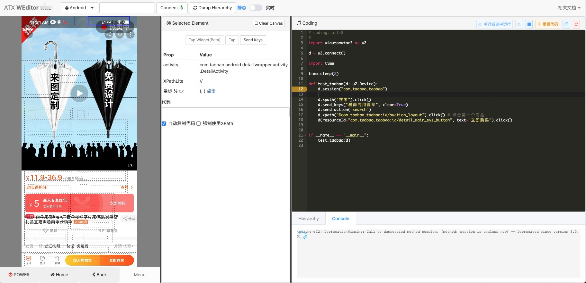

# WEditor
[](https://pypi.python.org/pypi/weditor)
[](https://github.com/alibaba/web-editor)
[](https://travis-ci.org/alibaba/web-editor)

[English README.md](README.md)

编辑器能够提供辅助编写脚本，查看组件信息，调试代码等功能。

Screenshot



## 安装
依赖项目

- Python3.6+
  - [uiautomator2](https://github.com/openatx/uiautomator2)
  - [facebook-wda](https://github.com/openatx/facebook-wda)


> Only tested in `Google Chrome`, _IE_ seems not working well.

```bash
pip3 install -U weditor # uiautomator2, facebook-wda会被作为依赖一并安装上去
```

如果要运行开发版本，安装方法如下

```bash
git clone https://github.com/alibaba/web-editor
pip3 install -e web-editor
```

## 使用方法
```bash
weditor # 启动server并打开浏览器
```

创建桌面快捷方式（仅限Windows）

```bash
weditor --shortcut
```

更多选项通过 `weditor --help` 查看

如果浏览器没有自动打开，可以手动访问 <http://localhost:17310>

> 17310这个端口是为了纪念，项目的创建日期 2017/03/10

## 常用快捷键

**Mac**

- Command+Enter: 运行编辑器中所有代码
- Command+SHIFT+Enter: 运行选中代码或光标所在行代码

**Windows**

- CTRL+Enter: 运行编辑器中所有代码
- CTRL+SHIFT+Enter: 运行选中代码或光标所在行代码

## 开发者文档
See [DEVELOP.md](DEVELOP.md)

## LICENSE
[MIT](LICENSE)
